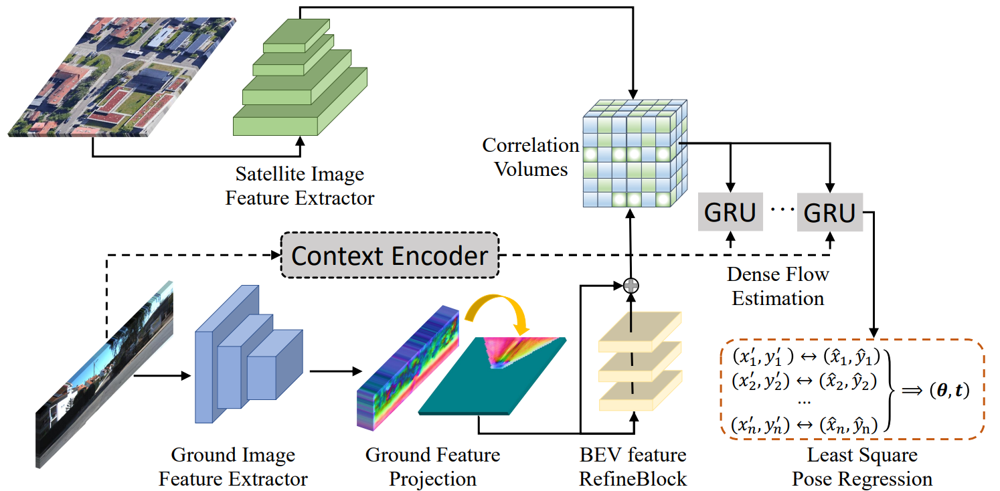

<h1 align="center">Learning Dense Flow Field for Highly-accurate Cross-view Camera Localization (NeurIPS 2023)</h1>

<p align="center">
    <!-- <a href="https://arxiv.org/abs/2310.05077">
    </a> -->
    <a href="https://papers.neurips.cc/paper_files/paper/2023/file/df5f94d6ac6e13d830d70536cde9f0d2-Paper-Conference.pdf"></a>
    <a href="https://github.com/zexianghui/CS2S_pose_environment">
    </a>
    <a href="https://github.com/zexianghui/CS2S_pose_environment/blob/main/LICENSE"></a>
</p>

>  [Zhenbo Song](https://github.com/ZhenboSong), [Xianghui Ze](https://github.com/zexianghui), [Jianfeng Lu](https://dblp.org/pid/82/6187-3.html), [Yujiao Shi](https://github.com/YujiaoShi)
> 
> **Abstract**: This paper addresses the problem of estimating the 3-DoF camera pose for a ground-level image with respect to a satellite image that encompasses the local surroundings. We propose a novel end-to-end approach that leverages the learning of dense pixel-wise flow fields in pairs of ground and satellite images to calculate
the camera pose. Our approach differs from existing methods by constructing the feature metric at the pixel level, enabling full-image supervision for learning distinctive geometric configurations and visual appearances across views. Specifically, our method employs two distinct convolution networks for ground and satellite feature extraction. Then, we project the ground feature map to the bird’s eye view (BEV) using a fixed camera height assumption to achieve preliminary
geometric alignment. To further establish the content association between the BEV and satellite features, we introduce a residual convolution block to refine the projected BEV feature. Optical flow estimation is performed on the refined BEV feature map and the satellite feature map using flow decoder networks based on RAFT. After obtaining dense flow correspondences, we apply the least square
method to filter matching inliers and regress the ground camera pose. Extensive experiments demonstrate significant improvements compared to state-of-the-art methods. Notably, our approach reduces the median localization error by 89%, 19%, 80%, and 35% on the KITTI, Ford multi-AV, VIGOR, and Oxford RobotCar datasets, respectively.



<p align="center"> &#x1F31F; If DenseFlow is helpful to your projects, please help star this repo. Thanks!</p>

# The Table of Contents
- [:clap: How to run](#clap-how-to-run)
  - [:one: Dataset](#one-dataset)
  - [:two: Training](#two-training)
  - [:three: Evaluation](#three-evaluation)
  - [:four: Files to be downloaded](#four-files-to-be-downloaded)
- [:fire: Citation](#fire-Citation)
- [:heart: Contact](#heart-contact)

## :one: Dataset
```bash
dataset
|-- KITTI
|-- Ford multi-AV
|-- Oxford RobotCar
|-- VIGOR

KITTI: please refer to https://github.com/shiyujiao/HighlyAccurate to download the dataset. Your dataset folder structure should be like:

Ford multi-AV: please refer to https://github.com/shiyujiao/HighlyAccurate to download the dataset. Your dataset folder structure should be like:

VIGOR: please refer to https://github.com/Jeff-Zilence/VIGOR and https://github.com/tudelft-iv/SliceMatch to download the dataset. Your dataset folder structure should be like:

Oxford RobotCar: For instructions on how to obtain the dataset, please visit https://github.com/tudelft-iv/CrossViewMetricLocalization.
```


## :two: Training
```bash
python BEV_KITTI_train.py

python BEV_Ford_train.py --train_log_start 0 --train_log_end 1 python BEV_Ford_train.py --train_log_start 1 --train_log_end 2

python BEV_VIGOR_train.py --area cross --rotation_range 0 python BEV_VIGOR_train.py --area cross --rotation_range 180 python BEV_VIGOR_train.py --area same --rotation_range 0 python BEV_VIGOR_train.py --area same --rotation_range 180

python BEV_oxford_train.py
```
## :three: Evaluation
```bash
python BEV_KITTI_test.py

python BEV_Ford_test.py -- test_log_ind 0 python BEV_Ford_test.py -- test_log_ind 1

python BEV_VIGOR_test.py --area cross --rotation_range 0 python BEV_VIGOR_test.py --area cross --rotation_range 180 python BEV_VIGOR_test.py --area same --rotation_range 0 python BEV_VIGOR_test.py --area same --rotation_range 180

python BEV_oxford_test.py
```

## :four: Files to be downloaded
1. Some files from the Oxford dataset
Some files from the Oxford dataset can be downloaded here and then placed in the dataLoader directory. https://drive.google.com/drive/folders/1B4RAqGwECydLgj4eeAVtnOxx8ob6sNBn?usp=drive_link

2. Model files https://drive.google.com/drive/folders/1sqIATdj5U-v21DyW31hTUpX4el76LTeF?usp=drive_link


# :fire: Citation
If our work is useful for your research, please consider citing:

```
@article{song2023learning,
  title={Learning dense flow field for highly-accurate cross-view camera localization},
  author={Song, Zhenbo and Lu, Jianfeng and Shi, Yujiao and others},
  journal={Advances in Neural Information Processing Systems},
  volume={36},
  pages={70612--70625},
  year={2023}
}
```

# :heart: Contact

If you have any questions, please feel free to reach out at [`zexh@njust.edu.cn`](mailto:zexh@njust.edu.cn).

<!-- 
### Dataset
KITTI:
please refer to https://github.com/shiyujiao/HighlyAccurate to download the dataset.
Your dataset folder structure should be like: 

KITTI:
  raw_data:
    2011_09_26:
      2011_09_26_drive_0001_sync:
        image_00:
        image_01:
        image_02:
        image_03:
	calib_cam_to_cam.txt
    2011_09_28:
    2011_09_29:
    2011_09_30:
    2011_10_03:
  satmap:
    2011_09_26:
        2011_09_26_drive_0001_sync：
    2011_09_29:
    2011_09_30:
    2011_10_03:


Ford multi-AV:
please refer to https://github.com/shiyujiao/HighlyAccurate to download the dataset.
Your dataset folder structure should be like: 

Ford:
  2017-08-04:
    V2:
      Log1:
        2017-08-04-V2-Log1-FL:
        SatelliteMaps_18:
        grd_sat_quaternion_latlon.txt
        grd_sat_quaternion_latlon_test.txt
  2017-10-26:
  Calibration-V2:

VIGOR:
please refer to https://github.com/Jeff-Zilence/VIGOR and https://github.com/tudelft-iv/SliceMatch to download the dataset.
Your dataset folder structure should be like: 

VIGOR:
    Chicago:
        panorama:
        satellite:
    NewYork:
    SanFrancisco:
    Seattle:
    splits_corrected：

Oxford RobotCar:
For instructions on how to obtain the dataset, please visit https://github.com/tudelft-iv/CrossViewMetricLocalization.


### Codes
1. Training:

python BEV_KITTI_train.py

python BEV_Ford_train.py --train_log_start 0 --train_log_end 1 
python BEV_Ford_train.py --train_log_start 1 --train_log_end 2 

python BEV_VIGOR_train.py --area cross --rotation_range 0
python BEV_VIGOR_train.py --area cross --rotation_range 180
python BEV_VIGOR_train.py --area same --rotation_range 0
python BEV_VIGOR_train.py --area same --rotation_range 180

python BEV_oxford_train.py  


2. Evaluation:

python BEV_KITTI_test.py

python BEV_Ford_test.py -- test_log_ind 0
python BEV_Ford_test.py -- test_log_ind 1

python BEV_VIGOR_test.py --area cross --rotation_range 0
python BEV_VIGOR_test.py --area cross --rotation_range 180
python BEV_VIGOR_test.py --area same --rotation_range 0
python BEV_VIGOR_test.py --area same --rotation_range 180

python BEV_oxford_test.py 

### Files to be downloaded
1. Some files from the Oxford dataset

Some files from the Oxford dataset can be downloaded here and then placed in the dataLoader directory.
[https://drive.google.com/drive/folders/1B4RAqGwECydLgj4eeAVtnOxx8ob6sNBn?usp=drive_link](https://drive.google.com/drive/folders/1B4RAqGwECydLgj4eeAVtnOxx8ob6sNBn?usp=drive_link)

2. Model files
[https://drive.google.com/drive/folders/1sqIATdj5U-v21DyW31hTUpX4el76LTeF?usp=drive_link](https://drive.google.com/drive/folders/1sqIATdj5U-v21DyW31hTUpX4el76LTeF?usp=drive_link) -->
